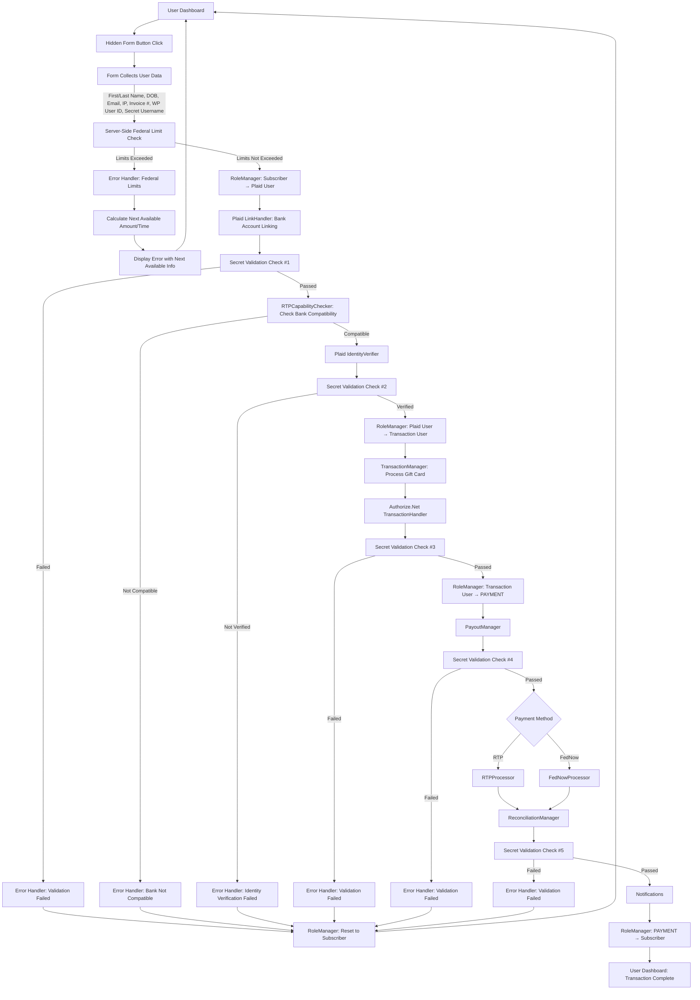

WP Admin Dashboard Optimizer Plugin -- Product Requirement Document (PRD)
========================================================================
# WP Admin Dashboard Optimizer - Architecture

## Directory Structure

The plugin follows WordPress best practices for directory structure:

```
wp-admin-dashboard-optimizer/
├── includes/                           # Core plugin functionality
│   ├── Core/                          # Main plugin logic
│   │   ├── RoleManager.php            # Role/capability management
│   │   ├── TokenManager.php           # OAuth token handling
│   │   ├── TransactionManager.php     # Gift card transaction handling
│   │   ├── PayoutManager.php          # Payout processing
│   │   ├── LimitManager.php           # Federal limit management
│   │   ├── ReconciliationManager.php  # Transaction reconciliation
│   │   └── FormHandler.php            # Hidden form processing
│   │
│   ├── Security/                      # Security implementations
│   │   ├── OAuth/                     # OAuth handling
│   │   │   ├── Provider.php           # OAuth provider implementation
│   │   │   ├── Client.php             # OAuth client implementation
│   │   │   └── Storage.php            # Token storage implementation
│   │   ├── Encryption.php             # Encryption handling
│   │   ├── Authentication.php         # Auth management
│   │   ├── SecretValidator.php        # Secret validation checks
│   │   └── HiddenUsername.php         # Hidden username generation/validation
│   │
│   ├── Database/                      # Database interactions
│   │   ├── Schema.php                 # Database schema definitions
│   │   ├── Migrations/                # Database migrations
│   │   │   ├── Migration_1_0_0.php    # Initial schema
│   │   │   └── Migration_Manager.php  # Migration handler
│   │   └── Models/                    # Database models
│   │       ├── Transaction.php        # Transaction model
│   │       ├── Token.php              # Token model
│   │       ├── Role.php               # Role model
│   │       ├── Payout.php             # Payout model
│   │       ├── ErrorLog.php           # Error log model
│   │       └── Reconciliation.php     # Reconciliation model
│   │
│   ├── API/                           # API integrations
│   │   ├── Plaid/                     # Plaid API integration
│   │   │   ├── Client.php             # Plaid API client
│   │   │   ├── LinkHandler.php        # Plaid Link handling
│   │   │   ├── WebhookHandler.php     # Plaid webhook processing
│   │   │   ├── IdentityVerifier.php   # Identity verification
│   │   │   └── RTPCapabilityChecker.php # RTP eligibility checking
│   │   ├── Authorize/                 # Authorize.net integration
│   │   │   ├── Client.php             # Authorize.net API client
│   │   │   └── TransactionHandler.php # Payment processing
│   │   └── Payment/                   # Payment processing methods
│   │       ├── RTPProcessor.php       # RTP payment processing
│   │       └── FedNowProcessor.php    # FedNow payment processing
│   │
│   ├── Notifications/                 # Notification system
│   │   ├── NotificationManager.php    # Notification orchestration
│   │   ├── EmailNotifier.php          # Email notifications
│   │   └── SMSNotifier.php            # SMS notifications
│   │
│   ├── ErrorHandlers/                 # Error handling system
│   │   ├── ErrorManager.php           # Error orchestration
│   │   ├── LimitExceededHandler.php   # Federal limit error handling
│   │   ├── BankCompatibilityHandler.php # Bank compatibility errors
│   │   ├── ValidationFailedHandler.php # Validation failure handling
│   │   └── PayoutFailedHandler.php    # Payout failure handling
│   │
│   ├── Admin/                         # WordPress admin interface
│   │   ├── Pages/                     # Admin pages
│   │   │   ├── Dashboard.php          # Main dashboard page
│   │   │   ├── Settings.php           # Settings page
│   │   │   ├── Reports.php            # Reporting page
│   │   │   └── Reconciliation.php     # Reconciliation page
│   │   ├── Ajax/                      # AJAX handlers
│   │   │   ├── TransactionAjax.php    # Transaction AJAX
│   │   │   ├── SetupAjax.php          # Setup wizard AJAX
│   │   │   └── LimitCheckAjax.php     # Limit check AJAX
│   │   └── Assets/                    # Admin assets
│   │       ├── css/                   # Stylesheets
│   │       ├── js/                    # JavaScript files
│   │       └── images/                # Image assets
│   │
│   └── Utils/                         # Utility classes
│       ├── Logger.php                 # Logging functionality
│       ├── Validator.php              # Data validation
│       ├── ErrorHandler.php           # Error handling
│       ├── TimeCalculator.php         # Time-based calculations
│       └── RateLimiter.php            # API rate limiting
│
├── tests/                             # Test suite
│   ├── Unit/                          # Unit tests
│   │   ├── Core/                      # Core functionality tests
│   │   │   ├── RoleManagerTest.php
│   │   │   ├── TokenManagerTest.php
│   │   │   ├── TransactionManagerTest.php
│   │   │   ├── PayoutManagerTest.php
│   │   │   ├── LimitManagerTest.php   # Federal limit tests
│   │   │   ├── ReconciliationManagerTest.php # Reconciliation tests
│   │   │   └── FormHandlerTest.php    # Form handling tests
│   │   │
│   │   ├── Security/                  # Security tests
│   │   │   ├── OAuth/
│   │   │   │   ├── ProviderTest.php
│   │   │   │   ├── ClientTest.php
│   │   │   │   └── StorageTest.php
│   │   │   ├── EncryptionTest.php
│   │   │   ├── AuthenticationTest.php
│   │   │   ├── SecretValidatorTest.php # Secret validation tests
│   │   │   └── HiddenUsernameTest.php # Hidden username tests
│   │   │
│   │   ├── Database/                  # Database tests
│   │   │   ├── SchemaTest.php
│   │   │   └── Models/
│   │   │       ├── TransactionTest.php
│   │   │       ├── TokenTest.php
│   │   │       ├── RoleTest.php
│   │   │       ├── PayoutTest.php     # Payout model tests
│   │   │       ├── ErrorLogTest.php   # Error log model tests
│   │   │       └── ReconciliationTest.php # Reconciliation model tests
│   │   │
│   │   ├── API/                       # API tests
│   │   │   ├── Plaid/
│   │   │   │   ├── ClientTest.php
│   │   │   │   ├── LinkHandlerTest.php
│   │   │   │   ├── WebhookHandlerTest.php
│   │   │   │   ├── IdentityVerifierTest.php # Identity verification tests
│   │   │   │   └── RTPCapabilityCheckerTest.php # RTP capability tests
│   │   │   ├── Authorize/
│   │   │   │   ├── ClientTest.php
│   │   │   │   └── TransactionHandlerTest.php
│   │   │   └── Payment/               # Payment processor tests
│   │   │       ├── RTPProcessorTest.php # RTP processor tests
│   │   │       └── FedNowProcessorTest.php # FedNow processor tests
│   │   │
│   │   ├── Notifications/             # Notification tests
│   │   │   ├── NotificationManagerTest.php # Notification manager tests
│   │   │   ├── EmailNotifierTest.php  # Email notification tests
│   │   │   └── SMSNotifierTest.php    # SMS notification tests
│   │   │
│   │   └── ErrorHandlers/             # Error handler tests
│   │       ├── ErrorManagerTest.php   # Error manager tests
│   │       ├── LimitExceededHandlerTest.php # Limit error tests
│   │       ├── BankCompatibilityHandlerTest.php # Bank error tests
│   │       ├── ValidationFailedHandlerTest.php # Validation error tests
│   │       └── PayoutFailedHandlerTest.php # Payout error tests
│   │
│   ├── Integration/                   # Integration tests
│   │   ├── API/                       # API integration tests
│   │   │   ├── PlaidIntegrationTest.php
│   │   │   ├── AuthorizeIntegrationTest.php
│   │   │   ├── RTPIntegrationTest.php # RTP integration tests
│   │   │   └── FedNowIntegrationTest.php # FedNow integration tests
│   │   ├── Database/                  # Database integration tests
│   │   │   └── MigrationTest.php
│   │   ├── Admin/                     # Admin integration tests
│   │   │   └── AdminPagesTest.php
│   │   └── Workflow/                  # Workflow integration tests
│   │       ├── FederalLimitWorkflowTest.php # Limit check workflow tests
│   │       ├── BankLinkingWorkflowTest.php # Bank linking workflow tests
│   │       └── PayoutWorkflowTest.php # Payout workflow tests
│   │
│   ├── Acceptance/                    # Acceptance tests
│   │   ├── UserFlowTest.php          # User journey tests
│   │   └── AdminFlowTest.php         # Admin journey tests
│   │
│   ├── Security/                      # Security tests
│   │   ├── VulnerabilityTest.php     # Security vulnerability tests
│   │   ├── EncryptionTest.php        # Encryption implementation tests
│   │   └── AuthenticationTest.php     # Authentication flow tests
│   │
│   ├── Mock/                          # Mock classes
│   │   ├── PlaidApiMock.php
│   │   ├── AuthorizeNetMock.php
│   │   ├── RTPProcessorMock.php      # RTP processor mock
│   │   └── FedNowProcessorMock.php   # FedNow processor mock
│   │
│   ├── bootstrap.php                  # Test bootstrap file
│   └── TestCase.php                   # Base test case class
│
├── bin/                               # CLI tools
│   └── install-wp-tests.sh            # Test environment setup
│
├── vendor/                            # Composer dependencies
│
├── assets/                            # Public assets
│   ├── css/                           # Public CSS
│   ├── js/                            # Public JavaScript
│   └── images/                        # Public images
│
├── languages/                         # Translations
│   ├── wp-admin-dashboard-optimizer.pot
│   └── wp-admin-dashboard-optimizer-en_US.po
│
├── composer.json                      # Composer configuration
├── phpunit.xml                        # PHPUnit configuration
├── .gitignore                         # Git ignore rules
├── .editorconfig                      # Editor configuration
├── README.md                          # Plugin documentation
└── wp-admin-dashboard-optimizer.php   # Main plugin file
```

## Component Relationships
### Workflow Diagram



## Key Process Elements

### Initial Form Submission and Federal Limit Check
1. User clicks a "button" (actually a hidden form) in their dashboard
2. Form collects user data (first/last name, DOB, email, IP, invoice #, WordPress ID, secret username)
3. Server-side federal limit check is performed immediately:
   - $500 in 24 hours
   - $1,500 in last 7 days
   - $3,500 since the 1st day of the current month
   - $8,500 since the 1st day of the current year
4. If limits are exceeded, user sees error with next available amount/time calculation
5. If limits are not exceeded, user proceeds to Plaid integration

### Secret Validation Checks
Multiple secret validation checks occur throughout the process:
1. After initial form submission
2. After bank account linking
3. After identity verification
4. Before payment processing
5. Before final payout

### Bank Compatibility Check
1. RTP/FedNow compatibility check happens after bank account linking and first secret validation
2. Users with incompatible banks are returned to Subscriber role with an error message
3. Identity verification only proceeds if the bank is compatible
4. Error messages attribute compatibility issues to the bank's security requirements

### Error Handling
All error paths return the user to Subscriber role and their dashboard with appropriate error messages.
### Core Components

1. **RoleManager**: Manages custom user roles (Plaid User, Transaction User, PAYMENT)
   - Handles role transitions based on user actions
   - Manages role expiry for temporary roles

2. **TokenManager**: Handles OAuth token lifecycle
   - Securely stores and retrieves tokens
   - Manages token refresh and expiry

3. **TransactionManager**: Processes gift card transactions
   - Validates transaction data
   - Records transaction history
   - Enforces federal limits

4. **PayoutManager**: Handles payouts via Plaid RTP or FedNow
   - Initiates payout process
   - Records payout details
   - Handles payout errors and retries

### Database Schema

The plugin uses custom database tables to store transaction data, error logs, and other information:

1. **wpado_plugin_transactions**: Stores transaction data
   - transaction_id (PRIMARY KEY)
   - user_id
   - invoice_number
   - gross_amount
   - net_payout_amount
   - fee_percentage
   - flat_fee
   - status
   - payout_status
   - payout_method
   - reconciliation_status
   - date_created
   - date_updated
   - additional_metadata

2. **wpado_plugin_error_logs**: Stores error logs
   - error_id (PRIMARY KEY)
   - error_code
   - error_message
   - error_data
   - user_id 
   - phase_error_occoured_in
   - date_error_occurred
   - time_error_occurred
   - additional_metadata
|
3. **wpado_plugin_payout_log**: Stores payout data
   - payout_id (PRIMARY KEY)
   - user_id
   - transaction_id
   - invoice_number
   - transaction_amount
   - payout_amount
   - payout_method
   - status
   - payout_date
   - payout_time
   - payout_bank_name
   - retry_count
   - next_retry_date

### API Integrations

1. **Plaid API**: Used for bank account linking and identity verification
   - OAuth 2.1 Authorization Code flow
   - Plaid Link modal for bank account linking
   - Webhooks for real-time updates

2. **Authorize.Net API**: Used for payment processing
   - Accept.js for secure payment handling
   - Transaction reporting
   - Webhooks for payment status updates

### Security Measures

1. **AES-256 Encryption**: Used for all sensitive data
   - Tokens
   - User data
   - Transaction data

2. **Hidden Usernames**: Extra layer of security during secret validation
   - Generated server-side
   - Encrypted with AES-256
   - Used during critical processes

3. **Rate Limiting**: Prevents abuse of API endpoints
   - Limits API calls to Plaid and Authorize.Net
   - Prevents brute force attacks

### Admin Interface

1. **Dashboard**: Provides overview of transactions and system status
   - Transaction summary
   - Error logs
   - System status

2. **Settings**: Allows configuration of plugin settings
   - API credentials
   - Security settings
   - Logging settings

3. **Reports**: Provides detailed reports on transactions and payouts
   - Transaction history
   - Payout history
   - Error logs


---------
* * * * * * * *
_________

# **TDD Philosophy – Red-Green-Refactor**

# ***Test-Driven Development MUST BE USED FOR EVERY SINGLE INSTANCE OF CODE WRITTEN***
## **TDD follows a predictable cycle:**

1. 🔴 **Red** — Write a failing test.
2. 🟢 **Green** — Implement just enough code to make it pass.
3. 🟡 **Refactor** — Clean the implementation while keeping the test green.

### Example:
```php
/** @test */
public function it_blocks_transactions_exceeding_daily_limit(): void {
    $userId = 1;
    $amount = 600.00;
    $meta = $this->createMock(MetaManager::class);
    $manager = new TransactionManager($meta);

    $this->expectException(RuntimeException::class);
    $this->expectExceptionMessage('Transaction exceeds your daily limit');

    $manager->validateLimit($userId, $amount);
}


* * * * * *

# Table of Contents

1. **Introduction**  
  	-**Overview**
	
2. **User Roles & Capabilities**  
   - Custom User Roles (Plaid User, Transaction User, PAYMENT)  
   - Additional Role Handling & Timing  
   - Hidden Usernames

3. **Secure API Interactions**  
   - WS Form Integration and Server Handlers  
   - Federal Required Limit Check (24h, 7d, Month, Year)  
   - Plaid API Integration via OAuth 2.1 (Link Token, PKCE, Redirect, State Validation)  
   - REST Endpoints for Plaid (Link Token, OAuth Callback, Public Token Exchange, IDV, RTP Capability, Payout, Webhook)  
   - Role Transitions Triggered by API Events  
   - Authorize.Net API Integration  
     - Accept.js Modal for Secure Tokenization  
     - Transaction Reporting via XML API  
     - Webhook Signature Validation and Role Transition to Payout  

4. **Token Management & Encryption**  
   - AES-256-CBC Encryption for Tokens (Plaid, Authorize.Net, Secrets)  
   - Encryption Key Handling and Rotation (90-day cycle)  
   - Token Lifecycle Management  
     - Plaid Public Token (short-lived) and Access Token (long-lived, rotated on invalidation)  
     - Authorize.Net Tokens (≤ 30 days)  
   - Token Purge Mechanisms via WP-Cron  
   - Logging and Audit (redacted payloads, retention policy)  
   - Webhook and Retry Policy (idempotency keys, exponential backoff)  
   - Data Retention and Purge (transactions, tokens, hidden data)  
   - Monitoring, Alerts, and QA Checks for API flowsiooi

5. **Secret Validation Checks**  
   - Real-Time Validation and Dynamic Field Management  
   - Post-Payment Secret Validation

6. **Webhook Handling**  
   - Plaid Webhooks  
   - Authorize.Net Webhooks

7. **Rate Limiting for API Calls**  
   - Plaid API Rate Limiting  
   - Authorize.Net API Rate Limiting

8. **Admin Settings & Configuration**  
   - API Credential Management  
   - Error Logging and Pagination

9. **Error Logging & Handling**  
   - Logging Functions  
   - Error Log Pagination

10. **Secret Checks & User Validation**  
    - Detailed Secret Validation Procedures

11. **Payout Process (Plaid RTP or FedNow)**  
    - Initiating Payout  
    - Logging Payout Details  
    - User Notifications

12. **User Dashboard & Transaction History**  
    - Displaying Transaction History  
    - Transaction Filtering

13. **Error Handling & Notifications for Failed Payouts**  
    - Error Logging Schema  
    - Retry Mechanism  
    - Admin and User Notifications

14. **Admin Management Enhancements**  
    - Viewing Transactions and Payouts  
    - Filtering Options

15. **Admin Management Enhancements (Continued)**  
    - Advanced Transaction Viewer  
    - Error Log Filtering

16. **Completion of Customer Path**  
    - Finalization Steps Post-Payout

17. **Database for User Transaction History**  
    - Database Table Creation Instructions  
    - Recording Transaction Data  
    - Server-Side Federal Required Limit Calculations

18. **Reconciliation Verification and Audit Logging**  
    - Reconciliation Check Functionality  
    - Scheduling Background Reconciliation Tasks  
    - Admin Dashboard Display for Reconciliation

19. **Conclusion**  
    - Summary of Features and Security Measures  
    - Additional Documentation & References


1\. Introduction
----------------

### 1.1. Overview

The **WP Admin Dashboard Optimizer Plugin** allows users to sell Visa, Mastercard, American Express, and Discover gift cards instantly, leveraging **Plaid** for secure bank account linking and **Authorize.Net** for payment processing. This PRD outlines the overall architecture, API integrations, security measures, and administrative controls needed for a secure and scalable solution. The plugin enforces **AES-256 encryption**, manages tokens securely, integrates with both Plaid (using OAuth 2.1) and Authorize.Net, and performs comprehensive error logging and multi-stage secret validation checks.

* * * * *

2\. User Roles and Capabilities
-------------------------------

### 2.1. Custom User Roles

The plugin defines three custom roles that control user flow. The site admin always has global override capability.

> **Note on naming:** In our high-level customer path, we introduced a `PAYMENT` role. In the original PRD, this was referred to as "Payout User." We now clarify that "Payout User" is equivalent to the **PAYMENT** role.

#### Role 1: Plaid User

-   **Assignment:** When a user begins linking their bank account with Plaid.
-   **Permissions:**
    -   Access to link their bank account using the **Plaid Link** flow.
    -   Limited to initiating the bank-linking process.
-   **Transition:** Once the bank account is successfully linked (and identity verification begins), the role is upgraded to **Transaction User**.

#### Role 2: Transaction User

-   **Assignment:** After the user successfully links their bank account.
-   **Permissions:**
    -   The user can now enter gift card details and proceed with transactions using **Authorize.Net**.
    -   They can initiate and manage gift card sales.
-   **Transition:** After successful payment authorization via **Authorize.Net**, the user becomes a **PAYMENT** user.

#### Role 3: PAYMENT

-   **Assignment:** When the user completes a sale and Authorize.Net has successfully processed the payment.
-   **Permissions:**
    -   The user can request a payout using **Plaid RTP** or **FedNow**.
    -   This role is temporary, granted only until the payout is complete.
-   **Transition:** After payout is processed, the user returns to their basic Subscriber role.

> In the corrected path, the typical journey is: **Subscriber** → **Plaid User** → **Transaction User** → **PAYMENT**→ back to **Subscriber**\
> **Admin** has global access at all times.

#### Additional Role Handling & Timing

1.  **Temporary Role Expiry:**\
    The system can treat roles like "Plaid User" or "Transaction User" as temporary (e.g. 30 minutes). If time expires, the plugin resets the user to the default role and clears session data.

    php

    Copy

    `function cfmgc_check_role_expiry($user_id) {
        $role_timer = get_user_meta($user_id, 'cfmgc_role_timer', true);
        $current_time = current_time('timestamp');
        if ($role_timer && ($current_time > $role_timer)) {
            // Clear session and reset role
            wp_clear_auth_cookie();
            wp_set_current_user(0);
            wp_set_auth_cookie($user_id);
            wp_safe_redirect(home_url());
            exit;
        }
    }`

### 2.2. Hidden Usernames

Each user is assigned a **hidden username** as an extra layer of security during secret validation. This value is generated server-side during user registration, encrypted with AES-256, and stored securely in the database. It is used during critical processes (e.g. pre-transaction validations) to ensure the authenticity of user data.

#### Workflow for Hidden Username

1.  During user registration via WS Form Pro, metadata (e.g., `user_id`) is submitted to a secure endpoint.
2.  The server immediately generates a unique hidden username using `wp_generate_password()` and encrypts it with AES-256.
3.  The encrypted hidden username is stored in the database as part of the registration process.
4.  During sensitive actions (e.g., before payment processing), the hidden username is retrieved, decrypted, and validated server-side.

*Example Code:*

php

Copy

`add_action('wsf_submit', function($submission) {
    $user_id = get_current_user_id();
    // Generate and encrypt the hidden username
    $hidden_username = 'user_' . wp_generate_password(12, false);
    $encrypted_hidden_username = encrypt_data($hidden_username);
    // Store securely in the database
    update_user_meta($user_id, 'cfmgc_hidden_username', $encrypted_hidden_username);
});
function encrypt_data($data) {
    $encryption_key = get_option('cfmgc_encryption_key');
    return openssl_encrypt($data, 'aes-256-cbc', $encryption_key, 0, GCISS_IV);
}`

*Additional Server-Side Hidden Username Validation:*

php

Copy

`function cfmgc_validate_hidden_username($user_id, $provided_username) {
    $encrypted_username = get_user_meta($user_id, 'cfmgc_hidden_username', true);
    if (empty($encrypted_username)) {
        return false;
    }
    $decrypted_username = cfmgc_decrypt_token($encrypted_username);
    return hash_equals($decrypted_username, $provided_username);
}`

A simple function to generate a hidden username:

php

Copy

`function cfmgc_generate_hidden_username($user_id) {
  $hidden_username = 'user_' . wp_generate_password(12, false);
  update_user_meta($user_id, 'cfmgc_hidden_username', $hidden_username);
}`

* * * * *

3\. Secure API Interactions
---------------------------

### 3.1. WS Form Integration with WPGet API Pro

WS Form Pro is used to interact securely with external APIs. In our workflow, the WS Form (disguised as a button) includes hidden fields capturing the user's first name, last name, date of birth, email, WordPress User ID, invoice number, and IP address. When clicked, two processes run concurrently:

-   **Federal Required Limit Check:**\
    The plugin calculates, server-side, the total dollar amount the user has liquidated in the last 24 hours, 7 days, since the first of the current month, and since the first of the year. The enforced limits are:
    -   $500 in the last 24 hours
    -   $1,500 in the last 7 days
    -   $2,500 since the first of the month
    -   $8,500 since the first of the year\
        This calculation occurs entirely on the server so that it cannot be manipulated by a hacker.
-   **OAuth 2.1 Initiation:**\
    The user is redirected into the Plaid OAuth flow for secure bank account linking.

*Example WS Form Button Setup:*

php

Copy

`add_action('wsf_submit', function($submission) {
    $user_id = get_current_user_id();
    $hidden_data = [
        'wp_user_id'    => $user_id,
        'first_name'    => get_user_meta($user_id, 'first_name', true),
        'last_name'     => get_user_meta($user_id, 'last_name', true),
        'date_of_birth' => get_user_meta($user_id, 'date_of_birth', true),
        'user_ip'       => $_SERVER['REMOTE_ADDR'],
    ];
    update_user_meta($user_id, 'cfmgc_hidden_data', $hidden_data);

    // Perform the federal required limit check
    if (!cfmgc_check_federal_limits($user_id)) {
       wp_send_json_error(['message' => 'Liquidation limits exceeded.']);
    }

    // Initiate the OAuth 2.1 flow for bank linking
    cfmgc_initiate_plaid_oauth($user_id);
});`

#### 3.1.1. Federal Required Limit Check

This security feature calculates the total liquidated amounts over required time periods and enforces the following limits:

-   **24 hours:** $500
-   **7 days:** $1,500
-   **Month-to-date:** $2,500
-   **Year-to-date:** $8,500

*Server-Side Calculation Example:*

php

Copy

`function cfmgc_calculate_liquidation_totals($user_id) {
    global $wpdb;
    $table = $wpdb->prefix . 'cfmgc_plugin_transactions';
    $totals = [
        'last_24_hours' => 0,
        'last_7_days'   => 0,
        'month_to_date' => 0,
        'year_to_date'  => 0,
    ];
    $last24 = date('Y-m-d H:i:s', strtotime('-24 hours'));
    $last7days = date('Y-m-d H:i:s', strtotime('-7 days'));
    $month_start = date('Y-m-01 00:00:00');
    $year_start = date('Y-01-01 00:00:00');

    $totals['last_24_hours'] = floatval($wpdb->get_var($wpdb->prepare(
        "SELECT SUM(amount) FROM $table WHERE user_id = %d AND date_created >= %s",
        $user_id, $last24
    )));
    $totals['last_7_days'] = floatval($wpdb->get_var($wpdb->prepare(
        "SELECT SUM(amount) FROM $table WHERE user_id = %d AND date_created >= %s",
        $user_id, $last7days
    )));
    $totals['month_to_date'] = floatval($wpdb->get_var($wpdb->prepare(
        "SELECT SUM(amount) FROM $table WHERE user_id = %d AND date_created >= %s",
        $user_id, $month_start
    )));
    $totals['year_to_date'] = floatval($wpdb->get_var($wpdb->prepare(
        "SELECT SUM(amount) FROM $table WHERE user_id = %d AND date_created >= %s",
        $user_id, $year_start
    )));
    return $totals;
}

function cfmgc_check_federal_limits($user_id) {
    $limits = [
        'last_24_hours' => 500,
        'last_7_days'   => 1500,
        'month_to_date' => 2500,
        'year_to_date'  => 8500,
    ];
    $totals = cfmgc_calculate_liquidation_totals($user_id);
    foreach ($limits as $period => $limit) {
        if ($totals[$period] > $limit) {
            return false;
        }
    }
    return true;
}`

### 3.2. Plaid API Integration via OAuth 2.1

The plugin uses Plaid's OAuth 2.1 Authorization Code flow for bank linking. On WS Form submission:

-   The user is redirected to the Plaid Link modal configured with OAuth parameters.
-   WPGet API Pro exchanges the authorization code for access and refresh tokens automatically.
-   These tokens are encrypted and stored for subsequent identity verification and fund transfer.

*Example Code:*

php

Copy

`function cfmgc_initiate_plaid_oauth($user_id) {
    $oauth_params = [
        'client_id'    => PLAID_CLIENT_ID,
        'redirect_uri' => home_url('/plaid-oauth-callback'),
        'scope'        => 'accounts,identity,transactions',
        'state'        => wp_generate_password(12, false),
    ];
    update_user_meta($user_id, 'cfmgc_plaid_oauth_state', $oauth_params['state']);
    $oauth_url = "https://sandbox.plaid.com/oauth/authorize?" . http_build_query($oauth_params);
    wp_redirect($oauth_url);
    exit;
}`

### 3.3. Authorize.Net API Integration

#### 3.3.1. Accept.js Integration

The Authorize.Net Accept.js modal securely tokenizes credit card details.

html

Copy

`<script type="text/javascript" src="https://js.authorize.net/v1/Accept.js"></script>
<form id="paymentForm">
  <input type="text" name="amount" value="50.00">
  <button type="submit">Submit Payment</button>
</form>
<script> document.getElementById('paymentForm').onsubmit = function(event) {
  event.preventDefault();
  Accept.dispatchData({
    apiLoginID: 'YOUR_API_LOGIN_ID',
    clientKey: 'YOUR_CLIENT_KEY',
    cardNumber: '4111111111111111',
    cardExpiration: '1225',
    cardCode: '123'
  }, cfmgc_handle_response);
}
function cfmgc_handle_response(response) {
  if (response.messages.resultCode === "Ok") {
    var token = response.opaqueData.dataValue;
    // Send token to your server for further processing
  } else {
    console.log(response.messages.message[0].text);
  }
} </script>`

#### 3.3.2. Transaction Reporting

After payment processing, transaction details are fetched for logging and status updates.

php

Copy

`function cfmgc_get_transaction_status($transaction_id) {
  $response = wp_remote_post(
    'https://apitest.authorize.net/xml/v1/request.api',
    [
      'body' => '<?xml version="1.0" encoding="utf-8"?>
        <getTransactionDetailsRequest xmlns="AnetApi/xml/v1/schema/AnetApiSchema.xsd">
          <merchantAuthentication>
            <name>' . AUTH_NET_API_LOGIN_ID . '</name>
            <transactionKey>' . AUTH_NET_TRANSACTION_KEY . '</transactionKey>
          </merchantAuthentication>
          <transId>' . $transaction_id . '</transId>
        </getTransactionDetailsRequest>',
      'headers' => ['Content-Type' => 'application/xml'],
    ]
  );
  return wp_remote_retrieve_body($response);
}`

#### 3.3.3. Authorize.Net Webhooks and Role Transition Handling

Webhooks from Authorize.Net are verified using a SHA-512 signature and trigger role transitions.

php

Copy

`function cfmgc_verify_auth_net_webhook($payload, $signature) {
  $calculated_signature = hash_hmac('sha512', $payload, AUTH_NET_SIGNATURE_KEY);
  return hash_equals($calculated_signature, $signature);
}

function cfmgc_authorize_net_webhook_handler($payload, $signature) {
  if (!cfmgc_verify_auth_net_webhook($payload, $signature)) {
    return new WP_Error('invalid_signature', 'Invalid webhook signature.');
  }
  $transaction_data = json_decode($payload, true);
  if ($transaction_data['status'] === 'authorized') {
    $user_id = $transaction_data['user_id'];
    wp_update_user(['ID' => $user_id, 'role' => 'payout_user']);
    $plaid_token = cfmgc_decrypt_token(get_user_meta($user_id, 'cfmgc_plaid_access_token', true));
    cfmgc_validate_payout($user_id, $plaid_token);
  }
}`

* * * * *

4\. Token Management and Encryption
-----------------------------------

Sensitive data such as Plaid access tokens and Authorize.Net transaction tokens are encrypted using AES-256 before storage.

*Example Code:*

php

Copy

`function cfmgc_encrypt_token($token) {
  $encryption_key = get_option('cfmgc_encryption_key'); // AES-256 key
  return openssl_encrypt($token, 'aes-256-cbc', $encryption_key, 0, GCISS_IV);
}
function cfmgc_decrypt_token($encrypted_token) {
  $encryption_key = get_option('cfmgc_encryption_key');
  return openssl_decrypt($encrypted_token, 'aes-256-cbc', $encryption_key, 0, GCISS_IV);
}`

-   **Token Lifecycle Management:**
    -   Plaid access tokens (expiring after 30 minutes) are refreshed automatically via the OAuth extension.
    -   Authorize.Net tokens are stored securely for up to 30 days before being purged.
    -   Tokens are decrypted only when necessary.

* * * * *

5\. Secret Validation Checks
----------------------------

### 5.1. Real-Time Validation and Dynamic Field Management

Server-side validations ensure data integrity, including transaction limit checks and hidden username verification. (WS Form Pro dynamically updates fields but all critical checks are performed on the server.)

*Example Transaction Limit Validation:*

php

Copy

`add_action('wp_ajax_validate_transaction', 'cfmgc_validate_transaction');
function cfmgc_validate_transaction() {
    $user_id = get_current_user_id();
    $transaction_amount = floatval($_POST['transaction_amount']);
    $daily_limit = 500;
    $daily_total = get_user_meta($user_id, 'daily_transaction_total', true) ?: 0;
    if (($daily_total + $transaction_amount) > $daily_limit) {
        wp_send_json_error(['message' => 'Transaction exceeds your daily limit.']);
    } else {
        // Proceed with transaction
    }
}`

### 5.2. Secret Validation Check (Pre-Payment)

Before processing a payment via Authorize.Net, a secret validation check ensures that the user's data is secure by verifying:

1.  First Name, Last Name, and Date of Birth (from WS Form/WordPress data)
2.  Hidden Username (generated and stored securely)

*Example Code:*

php

Copy

`function cfmgc_secret_check($user_id, $plaid_token) {
  $user_meta = get_user_meta($user_id);
  $username = $user_meta['cfmgc_hidden_username'][0];
  $dob = $user_meta['date_of_birth'][0];
  if ($username && cfmgc_compare_plaid_token($plaid_token, $username, $dob)) {
    return true; // Secret check passed
  }
  return new WP_Error('secret_check_failed', 'Secret validation failed.');
}`

*This check is intentionally performed at multiple stages (after linking, post-RTP eligibility, and pre-payout) to prevent tampering.*

* * * * *

6\. Webhook Handling
--------------------

### 6.1. Plaid Webhooks

Incoming Plaid webhooks (for account linking status, identity verification, and transaction updates) are validated using HMAC.

php

Copy

`function cfmgc_verify_plaid_webhook($payload, $signature) {
  $calculated_signature = hash_hmac('sha256', $payload, PLAID_WEBHOOK_SECRET);
  return hash_equals($calculated_signature, $signature);
}`

### 6.2. Authorize.Net Webhooks

(See Section 3.3.3 for webhook verification code.)

* * * * *

7\. Rate Limiting for API Calls
-------------------------------

### 7.1. Plaid API Rate Limiting

-   For example, 5 requests per user per hour for public token creation and 10 requests per user per day for access token exchange.

php

Copy

`function cfmgc_check_plaid_rate_limit($user_id, $api_call) {
  $current_time = current_time('timestamp');
  $rate_limit = get_user_meta($user_id, "cfmgc_rate_limit_$api_call", true);
  if ($rate_limit && ($current_time - $rate_limit['last_call']) < $rate_limit['interval']) {
    return false; // Exceeded
  }
  update_user_meta($user_id, "cfmgc_rate_limit_$api_call", [
    'last_call' => $current_time,
    'count'     => isset($rate_limit['count']) ? $rate_limit['count'] + 1 : 1,
    'interval'  => cfmgc_get_rate_limit_interval($api_call),
  ]);
  return true;
}`

### 7.2. Authorize.Net API Rate Limiting

-   For example, 3 transaction authorization/capture requests per minute. *Reference:* [Authorize.Net API Rate Limits](https://developer.authorize.net/api/reference/features/rate-limits.html)

* * * * *

8\. Admin Settings and Configuration
------------------------------------

### 8.1. API Credential Management

Admins manage credentials for Plaid and Authorize.Net securely, with all sensitive data stored encrypted.

php

Copy

`function cfmgc_save_api_credentials($plaid_client_id, $plaid_secret, $auth_net_login_id, $auth_net_transaction_key) {
  update_option('cfmgc_plaid_client_id', cfmgc_encrypt_token($plaid_client_id));
  update_option('cfmgc_plaid_secret', cfmgc_encrypt_token($plaid_secret));
  update_option('cfmgc_auth_net_login_id', cfmgc_encrypt_token($auth_net_login_id));
  update_option('cfmgc_auth_net_transaction_key', cfmgc_encrypt_token($auth_net_transaction_key));
}`

### 8.2. Error Logging and Pagination

Error logs are stored in a custom table (see SQL schema below) and can be paginated. *SQL Schema:*

sql

Copy

`CREATE TABLE IF NOT EXISTS `cfmgc_plugin_error_logs` (
  `id` BIGINT(20) UNSIGNED NOT NULL AUTO_INCREMENT,
  `error_code` VARCHAR(50) NOT NULL,
  `error_description` TEXT NOT NULL,
  `user_id` BIGINT(20) UNSIGNED DEFAULT NULL,
  `phase` VARCHAR(50),
  `date_logged` DATETIME NOT NULL DEFAULT CURRENT_TIMESTAMP,
  PRIMARY KEY (`id`),
  KEY `user_id` (`user_id`)
) ENGINE=InnoDB DEFAULT CHARSET=utf8mb4;`

*Pagination Example:*

php

Copy

`function cfmgc_display_error_log($page = 1) {
  global $wpdb;
  $errors_per_page = 10;
  $offset = ($page - 1) * $errors_per_page;
  $query = "
    SELECT * FROM {$wpdb->prefix}cfmgc_error_logs
    WHERE date_logged >= DATE_SUB(NOW(), INTERVAL 90 DAY)
    LIMIT %d OFFSET %d
  ";
  $errors = $wpdb->get_results($wpdb->prepare($query, $errors_per_page, $offset));
  foreach ($errors as $error) {
    echo "<tr>";
    echo "<td>{$error->error_code}</td>";
    echo "<td>{$error->error_description}</td>";
    echo "<td>{$error->user_id}</td>";
    echo "<td>{$error->phase}</td>";
    echo "<td>{$error->date_logged}</td>";
    echo "</tr>";
  }
}`

* * * * *

9\. Error Logging and Handling
------------------------------

All errors (from Plaid, Authorize.Net, or system processes) are logged for debugging and administrative review.

php

Copy

`function cfmgc_log_error($error_code, $description, $user_id = null, $phase = null) {
  global $wpdb;
  $wpdb->insert(
    "{$wpdb->prefix}cfmgc_error_logs",
    [
      'error_code'    => $error_code,
      'description'   => $description,
      'user_id'       => $user_id,
      'phase'         => $phase,
      'error_time'    => current_time('mysql'),
    ],
    ['%s', '%s', '%d', '%s', '%s']
  );
}`

*Retry Mechanism Example:*

php

Copy

`function cfmgc_retry_payout($payout_id, $attempt = 1) {
  if ($attempt > 3) {
    cfmgc_notify_admin_of_failed_payout($payout_id);
    return;
  }
  wp_schedule_single_event(time() + 900, 'cfmgc_retry_payout', array($payout_id, $attempt + 1));
}`

* * * * *

10\. Secret Checks and User Validation
--------------------------------------

Before a payment is processed via Authorize.Net, a secret validation check is performed to ensure the security of the user's data. This validation uses:

1.  **User Identity Data:** First name, last name, and date of birth (from WS Form/WordPress).
2.  **Hidden Username:** Securely stored during registration.

*Example Code:*

php

Copy

`function cfmgc_secret_check($user_id, $plaid_token) {
  $user_meta = get_user_meta($user_id);
  $username = $user_meta['cfmgc_hidden_username'][0];
  $dob = $user_meta['date_of_birth'][0];
  if ($username && cfmgc_compare_plaid_token($plaid_token, $username, $dob)) {
    return true; // Secret check passed
  }
  return new WP_Error('secret_check_failed', 'Secret validation failed.');
}`

*Note: This secret validation is executed at multiple critical stages (post-linking, post-RTP eligibility, and pre-payout) to prevent tampering.*

* * * * *

11\. Payout Process via Plaid RTP or FedNow
-------------------------------------------

Once the secret validation check has passed, the plugin initiates the payout process using Plaid RTP or FedNow.

### Payout Steps

1.  **Initiate Payout:**\
    The plugin uses the decrypted Plaid OAuth token to initiate the RTP/FedNow payout.
2.  **Log the Payout:**\
    Payout details (amount, timestamp, invoice number, transaction ID) are recorded.
3.  **Notify the User:**\
    The user receives an email/SMS notification with details such as payout amount, invoice number, and payout method; the dashboard is updated.

*SQL Schema for Payout Log:*

sql

Copy

`CREATE TABLE IF NOT EXISTS `cfmgc_plugin_payout_log` (
  `id` BIGINT(20) UNSIGNED NOT NULL AUTO_INCREMENT,
  `user_id` BIGINT(20) UNSIGNED NOT NULL,
  `invoice_number` VARCHAR(255) NOT NULL,
  `payout_amount` DECIMAL(10, 2) NOT NULL,
  `payout_date` DATETIME NOT NULL DEFAULT CURRENT_TIMESTAMP,
  `payout_method` VARCHAR(50) NOT NULL,
  `transaction_id` VARCHAR(255) NOT NULL,
  `status` VARCHAR(50) NOT NULL DEFAULT 'pending',
  PRIMARY KEY (`id`),
  KEY `user_id` (`user_id`)
) ENGINE=InnoDB DEFAULT CHARSET=utf8mb4;`

*Example Payout Confirmation Code:*

php

Copy

`function cfmgc_process_payout($user_id, $plaid_token) {
  if (!cfmgc_secret_check($user_id, $plaid_token)) {
    return new WP_Error('secret_check_failed', 'Secret check failed.');
  }
  $payout_response = cfmgc_initiate_payout($user_id);
  if (is_wp_error($payout_response)) {
    cfmgc_log_error('payout_error', 'Failed to process payout.', $user_id);
    return $payout_response;
  }
  cfmgc_log_payout($user_id, $payout_response);
  cfmgc_notify_user_of_payout($user_id, $payout_response);
  return true;
}`

* * * * *

12\. User Dashboard and Transaction History
-------------------------------------------

The user dashboard allows users to view their transaction history and payout status. Data is fetched from custom tables (`cfmgc_plugin_transactions` and `cfmgc_plugin_payout_log`).

### 12.1. Transaction History View

*Example Code:*

php

Copy

`function cfmgc_display_transaction_history($user_id, $page = 1) {
  global $wpdb;
  $transactions_per_page = 10;
  $offset = ($page - 1) * $transactions_per_page;
  $query = $wpdb->prepare("
    SELECT * FROM {$wpdb->prefix}cfmgc_plugin_transactions
    WHERE user_id = %d
    ORDER BY date_created DESC
    LIMIT %d OFFSET %d
  ", $user_id, $transactions_per_page, $offset);
  $transactions = $wpdb->get_results($query);
  foreach ($transactions as $transaction) {
    echo "<tr>";
    echo "<td>{$transaction->invoice_number}</td>";
    echo "<td>{$transaction->date_created}</td>";
    echo "<td>{$transaction->amount}</td>";
    echo "<td>{$transaction->status}</td>";
    echo "<td>{$transaction->payout_status}</td>";
    echo "</tr>";
  }
}`

### 12.2. Transaction Filtering

*Example Code:*

php

Copy

`function cfmgc_filter_transaction_history($user_id, $start_date, $end_date, $status, $payout_status) {
  global $wpdb;
  $query = "SELECT * FROM {$wpdb->prefix}cfmgc_plugin_transactions WHERE user_id = %d";
  if ($start_date && $end_date) {
    $query .= $wpdb->prepare(" AND date_created BETWEEN %s AND %s", $start_date, $end_date);
  }
  if ($status) {
    $query .= $wpdb->prepare(" AND status = %s", $status);
  }
  if ($payout_status) {
    $query .= $wpdb->prepare(" AND payout_status = %s", $payout_status);
  }
  return $wpdb->get_results($wpdb->prepare($query, $user_id));
}`

*Reference:* [WordPress Query Preparation](https://developer.wordpress.org/reference/functions/wpdb_prepare/)

* * * * *

13\. Error Handling and Notifications for Failed Payouts
--------------------------------------------------------

If a payout fails (due to network issues or invalid bank details), the plugin must:

1.  **Log the Error:**\
    Record details in the `cfmgc_plugin_error_logs` table.
2.  **Notify Admin:**\
    Email the admin with a link to the error logs.
3.  **Retry Mechanism:**\
    Automatically retry the payout after 15 minutes; if three attempts fail, escalate.
4.  **Notify User:**\
    Inform the user that the payout has failed and that an admin is investigating.

*SQL Schema for Error Logs:*

sql

Copy

`CREATE TABLE IF NOT EXISTS `cfmgc_plugin_error_logs` (
  `id` BIGINT(20) UNSIGNED NOT NULL AUTO_INCREMENT,
  `error_code` VARCHAR(50) NOT NULL,
  `error_description` TEXT NOT NULL,
  `user_id` BIGINT(20) UNSIGNED DEFAULT NULL,
  `phase` VARCHAR(50),
  `date_logged` DATETIME NOT NULL DEFAULT CURRENT_TIMESTAMP,
  PRIMARY KEY (`id`),
  KEY `user_id` (`user_id`)
) ENGINE=InnoDB DEFAULT CHARSET=utf8mb4;`

*Retry Mechanism Example:*

php

Copy

`function cfmgc_retry_payout($payout_id, $attempt = 1) {
  if ($attempt > 3) {
    cfmgc_notify_admin_of_failed_payout($payout_id);
    return;
  }
  wp_schedule_single_event(time() + 900, 'cfmgc_retry_payout', array($payout_id, $attempt + 1));
}`

* * * * *

14\. Admin Settings and Configuration
-------------------------------------

### 14.1. API Credential Management

Admins can manage API credentials for Plaid and Authorize.Net securely, with all sensitive data stored encrypted using AES-256.

php

Copy

`function cfmgc_save_api_credentials($plaid_client_id, $plaid_secret, $auth_net_login_id, $auth_net_transaction_key) {
  update_option('cfmgc_plaid_client_id', cfmgc_encrypt_token($plaid_client_id));
  update_option('cfmgc_plaid_secret', cfmgc_encrypt_token($plaid_secret));
  update_option('cfmgc_auth_net_login_id', cfmgc_encrypt_token($auth_net_login_id));
  update_option('cfmgc_auth_net_transaction_key', cfmgc_encrypt_token($auth_net_transaction_key));
}`

### 14.2. Error Logging and Pagination

Error logs (covering the last 90 days) are stored in a custom table and can be paginated.

*SQL Schema:* (see Section 8.2 above)

*Pagination Example:* (see Section 8.2 above)

* * * * *

15\. Admin Management Enhancements (Continued)
----------------------------------------------

### 15.1. View All Transactions and Payouts

*Example Code:*

php

Copy

`function cfmgc_admin_view_transactions($filter_args = array()) {
  global $wpdb;
  $default_args = array(
    'user_id'       => null,
    'start_date'    => null,
    'end_date'      => null,
    'status'        => null,
    'payout_method' => null,
  );
  $args = wp_parse_args($filter_args, $default_args);
  $query = "SELECT * FROM {$wpdb->prefix}cfmgc_plugin_transactions WHERE 1=1";
  if (!is_null($args['user_id'])) {
    $query .= $wpdb->prepare(" AND user_id = %d", $args['user_id']);
  }
  if (!is_null($args['start_date']) && !is_null($args['end_date'])) {
    $query .= $wpdb->prepare(" AND date_created BETWEEN %s AND %s", $args['start_date'], $args['end_date']);
  }
  if (!is_null($args['status'])) {
    $query .= $wpdb->prepare(" AND status = %s", $args['status']);
  }
  if (!is_null($args['payout_method'])) {
    $query .= $wpdb->prepare(" AND payout_method = %s", $args['payout_method']);
  }
  return $wpdb->get_results($query);
}`

### 15.2. Error Log Filtering

*Example Code:*

php

Copy

`function cfmgc_filter_error_logs($error_type = null, $start_date = null, $end_date = null) {
  global $wpdb;
  $query = "SELECT * FROM {$wpdb->prefix}cfmgc_plugin_error_logs WHERE 1=1";
  if (!is_null($error_type)) {
    $query .= $wpdb->prepare(" AND error_code = %s", $error_type);
  }
  if (!is_null($start_date) && !is_null($end_date)) {
    $query .= $wpdb->prepare(" AND date_logged BETWEEN %s AND %s", $start_date, $end_date);
  }
  return $wpdb->get_results($query);
}`

*Reference:* [WordPress Database Query Functions](https://developer.wordpress.org/reference/classes/wpdb/)

*Documentation for Admin Page Creation:* [Creating Admin Pages in WordPress](https://developer.wordpress.org/plugins/admin-menus/)

* * * * *

16\.  Completion of Customer Path (Handling After Payout)
--------------------------------------------------------

Once the user completes the Authorize.Net transaction and the Plaid token is available for payout, the final steps are:

1.  **Final Secret Validation:**\
    Validate the hidden username and identity data using the stored WS Form/WordPress data.
2.  **Initiate Payout:**\
    Use the decrypted Plaid OAuth token to call Plaid RTP or FedNow.
3.  **Log the Payout:**\
    Insert payout details into the database.
4.  **Notify the User:**\
    Send an email/SMS confirmation and update the dashboard.

*Example Payout Confirmation Code:* (see Section 11 above)


* * * * *


17\.  Database Creation and Transaction Tracking

To enforce federal required limits and to audit each user’s liquidated amounts, the plugin must create a dedicated database table to record every transaction. This table will store not only the basic transaction details but also both the gross amount charged via Authorize.Net and the net amount paid out by Plaid (after deducting the percentage fee and flat fee). This dual recording allows for an additional secure reconciliation check to ensure that the net payout matches the calculated amount.

### 17.1. Database Table Creation

When the plugin is activated, it should create a custom table (e.g., `cfmgc_plugin_transactions`) using the WordPress `dbDelta` function. The table must include at least the following columns:

- **id:** Primary key (auto-increment)
- **user_id:** The WordPress user ID
- **invoice_number:** A unique invoice identifier
- **gross_amount:** The total dollar amount charged to Authorize.Net
- **net_payout_amount:** The dollar amount deposited by Plaid after fees are deducted
- **fee_percentage:** The percentage fee applied
- **flat_fee:** The flat fee applied
- **status:** The transaction status (e.g., Pending, Completed, Failed)
- **payout_status:** The payout status (e.g., Pending, Processed, Failed)
- **reconciliation_status:** Status of the reconciliation check (e.g., pending, matched, mismatch)
- **date_created:** Timestamp when the transaction occurred

*Example Activation Hook Code:*
```php
function cfmgc_create_transactions_table() {
    global $wpdb;
    $table_name = $wpdb->prefix . 'cfmgc_plugin_transactions';
    $charset_collate = $wpdb->get_charset_collate();

    $sql = "CREATE TABLE $table_name (
        id BIGINT(20) UNSIGNED NOT NULL AUTO_INCREMENT,
        user_id BIGINT(20) UNSIGNED NOT NULL,
        invoice_number VARCHAR(255) NOT NULL,
        gross_amount DECIMAL(10,2) NOT NULL,
        net_payout_amount DECIMAL(10,2) NOT NULL,
        fee_percentage DECIMAL(5,2) NOT NULL,
        flat_fee DECIMAL(10,2) NOT NULL,
        status VARCHAR(50) NOT NULL,
        payout_status VARCHAR(50) NOT NULL,
        reconciliation_status VARCHAR(50) NOT NULL DEFAULT 'pending',
        date_created DATETIME NOT NULL DEFAULT CURRENT_TIMESTAMP,
        PRIMARY KEY (id),
        KEY user_id (user_id)
    ) $charset_collate;";

    require_once(ABSPATH . 'wp-admin/includes/upgrade.php');
    dbDelta($sql);
}
register_activation_hook(__FILE__, 'cfmgc_create_transactions_table');
```
*Instructions for the AI Coding Agent:*  
Ensure this function runs upon plugin activation so that the transaction history table is available for all subsequent operations.

### 17.2. Recording Transaction Data

During each transaction, record both the gross amount (charged to Authorize.Net) and the net payout amount (calculated after deducting fees). This function calculates the net payout amount by subtracting the percentage fee (applied on the gross amount) and the flat fee from the gross amount, then inserts the data into the transactions table.

*Example Code:*
```php
function cfmgc_record_transaction($user_id, $invoice_number, $gross_amount, $fee_percentage, $flat_fee, $status, $payout_status) {
    global $wpdb;
    // Calculate net payout amount: gross minus (percentage fee + flat fee)
    $net_payout_amount = $gross_amount - (($gross_amount * $fee_percentage / 100) + $flat_fee);
    $table = $wpdb->prefix . 'cfmgc_plugin_transactions';
    
    $result = $wpdb->insert(
        $table,
        [
            'user_id'           => $user_id,
            'invoice_number'    => $invoice_number,
            'gross_amount'      => $gross_amount,
            'net_payout_amount' => $net_payout_amount,
            'fee_percentage'    => $fee_percentage,
            'flat_fee'          => $flat_fee,
            'status'            => $status,
            'payout_status'     => $payout_status,
            'date_created'      => current_time('mysql')
        ],
        ['%d', '%s', '%f', '%f', '%f', '%f', '%s', '%s', '%s']
    );
    
    return $result;
}
```
*Instructions:*  
Call this function immediately after processing an Authorize.Net transaction. This will store both amounts, allowing for later reconciliation.

### 17.3. Calculating Federal Required Limits

The plugin must calculate the total liquidated amounts for a user over various periods by querying the transactions table. This calculation must be done server-side to ensure data integrity.

*Example Code:*
```php
function cfmgc_calculate_liquidation_totals($user_id) {
    global $wpdb;
    $table = $wpdb->prefix . 'cfmgc_plugin_transactions';
    $totals = [
        'last_24_hours' => 0,
        'last_7_days'   => 0,
        'month_to_date' => 0,
        'year_to_date'  => 0,
    ];
    $last24 = date('Y-m-d H:i:s', strtotime('-24 hours'));
    $last7days = date('Y-m-d H:i:s', strtotime('-7 days'));
    $month_start = date('Y-m-01 00:00:00');
    $year_start = date('Y-01-01 00:00:00');
    
    $totals['last_24_hours'] = floatval($wpdb->get_var($wpdb->prepare(
        "SELECT SUM(gross_amount) FROM $table WHERE user_id = %d AND date_created >= %s",
        $user_id, $last24
    )));
    $totals['last_7_days'] = floatval($wpdb->get_var($wpdb->prepare(
        "SELECT SUM(gross_amount) FROM $table WHERE user_id = %d AND date_created >= %s",
        $user_id, $last7days
    )));
    $totals['month_to_date'] = floatval($wpdb->get_var($wpdb->prepare(
        "SELECT SUM(gross_amount) FROM $table WHERE user_id = %d AND date_created >= %s",
        $user_id, $month_start
    )));
    $totals['year_to_date'] = floatval($wpdb->get_var($wpdb->prepare(
        "SELECT SUM(gross_amount) FROM $table WHERE user_id = %d AND date_created >= %s",
        $user_id, $year_start
    )));
    return $totals;
}

function cfmgc_check_federal_limits($user_id) {
    $limits = [
        'last_24_hours' => 500,
        'last_7_days'   => 1500,
        'month_to_date' => 2500,
        'year_to_date'  => 8500,
    ];
    $totals = cfmgc_calculate_liquidation_totals($user_id);
    foreach ($limits as $period => $limit) {
        if ($totals[$period] > $limit) {
            return false;
        }
    }
    return true;
}
```
*Instructions:*  
Integrate these functions to enforce the federal required limits on every WS Form submission.

-------

* * * * * 

18\. Admin Dashboard Display and Reconciliation Verification

Admins must have a dedicated dashboard to review all transaction records. This page should list each transaction with all recorded fields (including gross amount, net payout amount, fees, and reconciliation status) and offer pagination and filtering.

### 18.1. Admin Dashboard Display for Transactions

*Example Code to Create a Custom Admin Page:*
```php
function cfmgc_register_admin_transaction_page() {
    add_menu_page(
        'Transaction History',        // Page title
        'Transactions',               // Menu title
        'manage_options',             // Capability required
        'gciss-transactions',         // Menu slug
        'cfmgc_render_admin_transactions_page', // Callback function
        'dashicons-list-view',        // Icon URL
        6                           // Position
    );
}
add_action('admin_menu', 'cfmgc_register_admin_transaction_page');

function cfmgc_render_admin_transactions_page() {
    global $wpdb;
    $table_name = $wpdb->prefix . 'cfmgc_plugin_transactions';
    
    echo '<div class="wrap">';
    echo '<h1>Transaction History</h1>';
    
    // Retrieve transactions (implement pagination and filtering as needed)
    $transactions = $wpdb->get_results("SELECT * FROM $table_name ORDER BY date_created DESC");
    
    if ($transactions) {
        echo '<table class="widefat fixed" cellspacing="0">';
        echo '<thead><tr>';
        echo '<th>ID</th>';
        echo '<th>User ID</th>';
        echo '<th>Invoice Number</th>';
        echo '<th>Gross Amount</th>';
        echo '<th>Net Payout</th>';
        echo '<th>Fee (%)</th>';
        echo '<th>Flat Fee</th>';
        echo '<th>Status</th>';
        echo '<th>Payout Status</th>';
        echo '<th>Reconciliation</th>';
        echo '<th>Date Created</th>';
        echo '</tr></thead>';
        echo '<tbody>';
        foreach ($transactions as $transaction) {
            echo '<tr>';
            echo '<td>' . esc_html($transaction->id) . '</td>';
            echo '<td>' . esc_html($transaction->user_id) . '</td>';
            echo '<td>' . esc_html($transaction->invoice_number) . '</td>';
            echo '<td>' . esc_html($transaction->gross_amount) . '</td>';
            echo '<td>' . esc_html($transaction->net_payout_amount) . '</td>';
            echo '<td>' . esc_html($transaction->fee_percentage) . '</td>';
            echo '<td>' . esc_html($transaction->flat_fee) . '</td>';
            echo '<td>' . esc_html($transaction->status) . '</td>';
            echo '<td>' . esc_html($transaction->payout_status) . '</td>';
            echo '<td>' . esc_html($transaction->reconciliation_status) . '</td>';
            echo '<td>' . esc_html($transaction->date_created) . '</td>';
            echo '</tr>';
        }
        echo '</tbody>';
        echo '</table>';
    } else {
        echo '<p>No transactions found.</p>';
    }
    echo '</div>';
}
```
*Instructions for the AI Coding Agent:*  
Use `add_menu_page` to add a “Transaction History” page to the WordPress admin. Implement pagination and filtering similarly to how error logs are handled.

### 18.2. Reconciliation Check

To verify that the Authorize.Net gross amount (minus fees) exactly correlates to the Plaid net payout, implement a reconciliation function. This function should run asynchronously (e.g., via WP Cron) to avoid performance impacts.

*Example Code:*
```php
function cfmgc_reconcile_transaction($transaction_id) {
    global $wpdb;
    $table = $wpdb->prefix . 'cfmgc_plugin_transactions';
    $transaction = $wpdb->get_row($wpdb->prepare("SELECT * FROM $table WHERE id = %d", $transaction_id));

    if (!$transaction) {
        return new WP_Error('transaction_not_found', 'Transaction not found.');
    }
    
    // Calculate expected net amount based on gross amount and fees
    $expected_net = $transaction->gross_amount - (($transaction->gross_amount * $transaction->fee_percentage / 100) + $transaction->flat_fee);
    
    // Allow a small margin for rounding differences
    if (abs($expected_net - $transaction->net_payout_amount) < 0.01) {
        // Update reconciliation status as "matched"
        $wpdb->update($table, ['reconciliation_status' => 'matched'], ['id' => $transaction_id], ['%s'], ['%d']);
        return true;
    } else {
        // Update reconciliation status as "mismatch" and log error
        $wpdb->update($table, ['reconciliation_status' => 'mismatch'], ['id' => $transaction_id], ['%s'], ['%d']);
        cfmgc_log_error('reconciliation_mismatch', 'Calculated net payout does not match stored value.', $transaction->user_id, 'reconciliation');
        return false;
    }
}
```
*Instructions:*  
Schedule this reconciliation check via WP Cron to run periodically (e.g., nightly) or immediately after payout processing to verify that the net payout amount is correct.

### 18.3. Additional Recommendations

- **Extra Secure Check:**  
  Performing reconciliation is highly recommended. Running it as a background task (via WP Cron) minimizes any performance impact while ensuring financial integrity.
  
- **Audit Logging:**  
  Maintain detailed logs for every reconciliation attempt, including mismatches, to support quick investigation.
  
- **Admin Notifications:**  
  Configure admin alerts (via email or dashboard notifications) if a reconciliation mismatch is detected.

---

### Summary of Sections 17 and 18

- **Section 18** provides full database creation instructions, including a table schema to track each transaction, code for recording both gross and net amounts (plus fee details), and server-side functions for calculating federal required limits.
- **Section 19** details the admin dashboard interface for displaying transactions and implements a reconciliation check to verify that the net payout correlates exactly to the Authorize.Net charge after fees.

These sections must be integrated into your overall PRD so that the plugin can both enforce federal limits and provide an audit trail with full transparency in the admin dashboard.

---

Please review this new section (Sections 18 and 19) and let me know if any further adjustments or additions are required.


19\. Conclusion
---------------

This **Product Requirement and Functional Design (PRFD)** document fully covers the entire user journey for the **WP Admin Dashboard Optimizer Plugin** from:

-   **Initial gift card sale,**
-   Through secure payment processing (via Authorize.Net) and bank account linking (via Plaid using OAuth 2.1),
-   To the final payout and completion.

It includes:

-   Comprehensive **API integrations** with Plaid (using OAuth 2.1) and Authorize.Net.
-   Detailed **user role management:** Subscriber → Plaid User → Transaction User → PAYMENT → Subscriber.
-   Full **payout process logging** and robust error handling (with automated retry mechanisms and admin notifications).
-   **Security measures** such as AES-256 encryption, hidden username generation and validation (all executed server-side), and multiple secret validation checkpoints.
-   **Federal required limit checks** that calculate total liquidated amounts over the last 24 hours, 7 days, month-to-date, and year-to-date.
-   **Admin dashboard enhancements** for viewing and filtering transactions, payouts, and error logs.
-   **User dashboard enhancements** for real-time transaction history and status updates.

All legacy elements not needed because of OAuth 2.1 integration have been removed. The additional security features (federal required limit check and hidden username server-side validation) are fully integrated with example code that follows WordPress best practices.

* * * * *

### Additional Documentation & References

1.  [Plaid Identity API Documentation](https://plaid.com/docs/api/identity/)
2.  [Plaid Real-Time Payments (RTP) API Documentation](https://plaid.com/docs/api/products/transfer/)
3.  [Authorize.Net Accept.js Documentation](https://developer.authorize.net/api/reference/features/acceptjs.html)
4.  [Authorize.Net Webhooks Documentation](https://developer.authorize.net/api/reference/features/webhooks.html)
5.  [Authorize.Net Reporting API Documentation](https://developer.authorize.net/api/reference/features/reporting.html)
6.  [Plaid Webhooks Documentation](https://plaid.com/docs/api/webhooks/)
7.  [OpenSSL Encryption Documentation](https://www.php.net/manual/en/function.openssl-encrypt.php)
8.  [WordPress Database Query Functions](https://developer.wordpress.org/reference/classes/wpdb/)
9.  [WordPress Error Handling Documentation](https://developer.wordpress.org/plugins/security/securing-output/)
10. [WordPress Pagination Documentation](https://developer.wordpress.org/plugins/pagination/)
11. [Creating Admin Pages in WordPress](https://developer.wordpress.org/plugins/admin-menus/)
12. [WordPress Database Access with $wpdb](https://developer.wordpress.org/plugins/database/accessing-databases/)

* * * * *

2\. Customer Path Through Custom Plugin
=======================================

This section restates the complete customer path in the correct order while preserving every detail (except those made redundant by OAuth 2.1). No information is omitted.

markdown

Copy

`# Customer Path Through Gift Card Liquidation

## 🎯 Overview

This document outlines the end-to-end workflow for gift card liquidation, integrating robust backend architecture, comprehensive error handling, UX/UI enhancements, third-party dependencies, and layered security measures (including federal required limit checks and multiple secret validation checkpoints) for a seamless, scalable user experience.

---

## 📚 Phase 1: User Authentication & Initial Transaction Setup

### 1.1. User Authentication & Login
- Users securely log into the WordPress site via SSL/TLS.
- Authentication uses WordPress's native user management (with reCAPTCHA, HTTP-only cookies, and account lockout for failed logins).

### 1.2. Dashboard Access & Transaction Initiation
- Upon successful login, users access their dynamic dashboard (via JetEngine).
- A WS Form, displayed as a button ("Sell My Gift Card"), includes hidden fields for:
 - First Name, Last Name, Date of Birth, Email, WordPress User ID, Invoice Number, and User IP.
- When clicked, two processes run concurrently:
 - **Federal Required Limit Check:**
 Calculates total liquidated amounts over:
    - Last 24 hours (limit: $500)
    - Last 7 days (limit: $1,500)
    - Month-to-date (limit: $2,500)
    - Year-to-date (limit: $8,500)
    All calculations are performed server-side.
  - **OAuth 2.1 Initiation:**
    Redirects the user into the Plaid OAuth flow for secure bank account linking.
- If both checks pass, the user's role is updated from Subscriber → **PLAID**.
---

## 📚 Phase 2: Bank Account Linking with Plaid via OAuth 2.1

### 2.1. Initiate OAuth Flow
- WS Form submission saves hidden user data and triggers the OAuth 2.1 flow.
- The federal required limit check is enforced; if exceeded, an error message is shown.

### 2.2. Plaid Modal & Bank Linking
- The user is redirected to the Plaid Link modal (configured for OAuth).
- After successful bank authentication, Plaid returns an authorization code that is exchanged for access and refresh tokens automatically.
- The user remains in the **PLAID** role until further validation.

### 2.3. RTP Eligibility & Identity Verification
- First, the system checks if the linked bank account supports RTP (using Plaid's /transfer/capabilities/get).
 - If the account is incompatible, an error ("Your bank does not support RTP payments. Please try a different account.") is shown and the process stops.
- Only after RTP compatibility is confirmed, the user's stored identity data is submitted for verification via multiple secret validation checks (ensuring first name, last name, date of birth, and hidden username match the bank account owner).
- On passing both RTP compatibility and identity verification, the role is updated from **PLAID** → **Transaction User**.

---

## 📚 Phase 3: User Inputs Transaction Amount

- With the **Transaction User** role, the user enters gift card details through WS Form Pro.
- The form validates input ranges (e.g., gift card value between $20 and $500) and provides real-time feedback.

---

## 📚 Phase 4: Payment Processing with Authorize.Net

- The Authorize.Net Accept.js modal is launched for secure payment processing.
- WS Form Pro's Authorize.Net extension processes the payment, ensuring no sensitive card data touches our servers.
- On successful payment authorization (confirmed via webhooks), the user's role is updated to **PAYMENT**.

---

## 📚 Phase 5: Payout to User (PAYMENT Role) via Plaid RTP or FedNow

- As a user in the **PAYMENT** role, a final secret validation check is performed.
- Using the decrypted Plaid OAuth token, the plugin initiates the payout via Plaid RTP or FedNow.
- Payout details are logged and the user is notified (via email/SMS).

---

## 📚 Phase 6: User Notification & Finalization

- The user receives an email/SMS notification of a successful payout.
- Transaction history is updated on the dashboard.
- OAuth tokens are managed automatically (with background refresh).
- The user's role is reset to Subscriber (or maintained as configured).`

____
* * * * * * * 